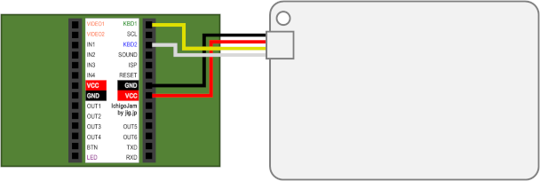
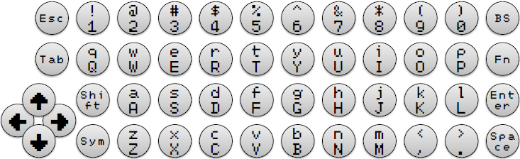
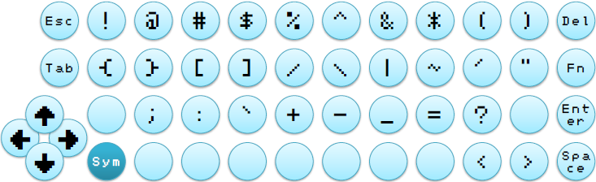
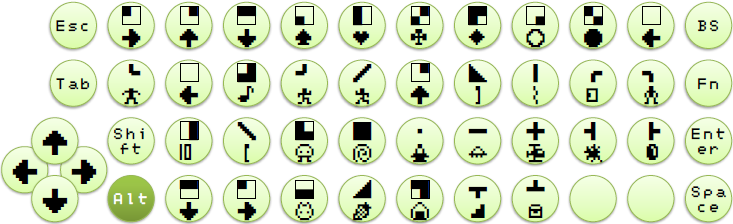
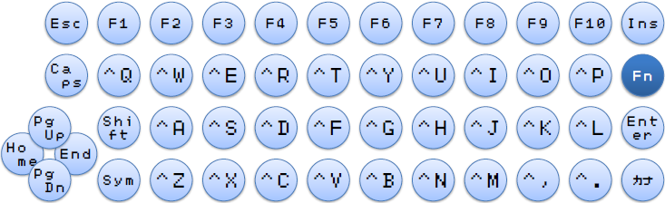

# CardKB4IchigoJam 

[IchigoJam](https://ichigojam.net/) 用に改造した [CardKB](https://docs.m5stack.com/#/ja/unit/cardkb) のファームウェアです。

[HEX ファイルをダウンロードする](https://github.com/obono/CardKB4IchigoJam/releases/latest)

## 使用方法

* IchigoJam は US キーボード用のファームウェアが焼かれている前提です。
* CardKB のファームウェアを書き換えます。
  * ファームウェアの書き換え方法は、下記参考記事を参照するなどしてご自分で調べてください。
  * Arduino IDE でソースコードからファームウェアをビルドする際は、'Adafruit NeoPixel' ライブラリが必要です。
  * **注意: ファームウェア書き換えにより、CardKB が故障する等、いかなる損害が発生したとしても、当方は一切責任は取りません。自己責任で行ってください。**
* IchigoJam と CardKB をこのように接続します。 
  * GROVE ケーブルを改造して、USB 端子や PS/2 端子を結線した上で接続するのも良いでしょう。
    CardKB  |IchigoJam|USB|PS/2
    --------|---------|---|----
    黒 (GND)|GND      |GND|3 (GND)
    赤 (VCC)|VCC      |5V |4 (VCC)
    黄 (A4) |KBD1     |D+ |5 (+CLK)
    白 (A5) |KBD2     |D- |1 (+DATA)

## キーボードレイアウト

### 標準モード

標準的なモードです。

右上のキーは Backspace キーとして機能します。

シフトキーを一度押すと LED が赤く点滅し、その状態で一文字入力すると、シフトキーを押しながら入力したことになります。この場合、入力後は LED の点滅が止まり、元の状態に戻ります。
シフトキーを二度押すと LED が赤く点灯し、以降は何文字入力してもシフトキーを押しながら入力したことになり、LED も点灯したままになります。解除するにはもう一度シフトキーを押します。

Sym キーや Fn キーを押すと、キーに応じたモードに遷移します。こちらについても、シフトキーと同様、一度押した場合は LED がモードに応じた色の点滅をし、一文字入力すると標準モードに戻ります。
二度押すと、LED が点灯し、何文字入力してもモードを維持します。標準モードにするには、同じキーをもう一度押します。

### Sym モード

Sym キーを押すことで　Sym モードになります。LED は水色に光ります。シフトキーは**利用できません**。

キーボードに記されている記号を入力することができます。右上のキーは Delete キーとして機能します。

### Alt モード

Sym キーを**長押し**することで、Alt モードになります。LED は緑色に光ります。標準モードと同様にシフトキーが利用できます。

Alt キーを押しながらのキー入力になり、IchigoJam のグラフィックキャラクターを入力することができます。右上のキーは Backspace キーとして機能します。

### Fn モード

Fn キーを押すことで Fn モードになります。LED は青色に光ります。標準モードと同様にシフトキーが利用できます。

数字キーはファンクションキーに、アルファベットキーは Ctrl キーを押しながらのキー入力になります。その他のいくつかのキーも別のキーとして機能します。

キー  |機能
------|------
Delete|Insert
Tab   |Caps Lock
Up    |Page up
Down  |Page down
Left  |Home
Right |End
Space |カナ入力モード切り替え

## 参考

* [CardKeyBoard サンプルコード(公式)](https://github.com/m5stack/M5-ProductExampleCodes/blob/master/Unit/CARDKB/firmware_328p/CardKeyBoard/CardKeyBoard.ino)
* [CardKeyBoard PS/2 インタフェース版](https://github.com/Tamakichi/CardKeyBoard_PS2) by [たま吉さん](http://nuneno.cocolog-nifty.com/)
* [M5Stack の CardKB のファームウェアを書き換える](http://asamomiji.jp/contents/modifying-cardkb-firmware)
* [M5Stack : CardKB ファームウェア更新](https://shikarunochi.matrix.jp/?p=2910)

## ライセンス

[MIT ライセンス](LICENSE).

