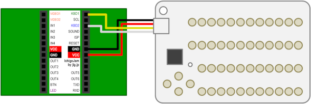
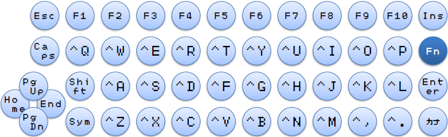

# CardKB4IchigoJam 

A customized firmware of [CardKB](https://docs.m5stack.com/#/en/unit/cardkb) for [IchigoJam](https://ichigojam.net/index-en.html).

[Download the HEX file of the firmware](https://github.com/obono/CardKB4IchigoJam/releases/latest)

## How to use

* **Your IchigoJam must be US layout keyboard version.**
* Burn the firmware to your CardKB.
  * Search how to burn the firmware yourself.
  * 'Adafruit NeoPixel' library is needed when building the firmware from the source code on Arduino IDE.
  * **Caution: I won't be liable for damages arising from the use of this program in any event. Do it at your own risk.**
* Connect IchigoJam and CardKB. 
  CardKB     |IchigoJam|USB|PS/2
  -----------|---------|---|----
  Black (GND)|GND      |GND|3 (GND)
  Red (VCC)  |VCC      |5V |4 (VCC)
  Yellow (A4)|KBD1     |D+ |5 (+CLK)
  White  (A5)|KBD2     |D- |1 (+DATA)

## Keyboard layouts

### Normal mode

Delete key (the key at top right) works as *Backspace*.

### Sym mode

It becomes *Sym mode* by pressing Sym key. Shift key is NOT available.

You can input symbol characters.

Delete key works as *Delete*.

### Alt mode

It becomes *Alt mode* by **HOLDING Sym key**.

An alphabet keys is modified with Alt key, so you can input graphical characters.

Delete key works as *Backspace*.

### Fn mode

It becomes *Fn mode* by pressing Fn key.

A digit key works as function key. An alphabet keys is modified with Ctrl key.

The key assign changes as following:

Key   |Assign
------|------
Delete|Insert
Tab   |Caps Lock
Up    |Page up
Down  |Page down
Left  |Home
Right |End
Space |Toggle KANA mode

## References

* [CardKeyBoard sample code (official)](https://github.com/m5stack/M5-ProductExampleCodes/blob/master/Unit/CARDKB/firmware_328p/CardKeyBoard/CardKeyBoard.ino)
* [CardKeyBoard PS/2 Interface version](https://github.com/Tamakichi/CardKeyBoard_PS2) by [Tamakichi](http://nuneno.cocolog-nifty.com/)

## License

This program is licensed under [MIT License](LICENSE).
